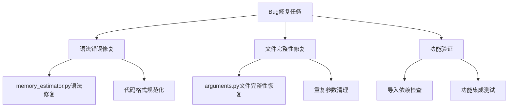

# Megatron-LM 跨数据中心训练优化模块Bug修复设计

## 概述

本设计文档描述了对之前实现的跨数据中心训练优化功能中发现的代码缺陷的修复方案。主要涉及性能监控、内存估算、预训练性能采样和参数配置等核心模块的代码问题修复。

## 问题分析

### 1. memory_estimator.py 语法错误

**问题位置**: 第99-102行
```python
# 问题代码
optimizer_states_gb = parameters_gb  
# 其他优化器通常需要1x参数内存\n        
        return {
            'parameters_gb': parameters_gb,
            'gradients_gb': gradients_gb, 
            'optimizer_states_gb': optimizer_states_gb,
            }        def estimate_activation_memory_per_layer(self, args) -> float:        \"\"\"估算单层的激活内存大小（MB）\"\"\"
```

**问题类型**:
- 方法定义被错误连接
- 转义字符`\n`出现在注释中
- 缺少正确的方法分隔和缩进

### 2. arguments.py 文件截断问题

**问题位置**: 文件末尾
```python
# 问题代码
    group.add_argument('--record-memory-history', action="store_true", default=False,
                       help='Record memory history in last rank.')
    group.```
```

**问题类型**:
- 文件被意外截断
- 参数定义重复
- 缺少完整的函数返回语句

### 3. 潜在导入和依赖问题

需要验证所有新增模块的导入路径和依赖关系是否正确。

## 修复方案

### 方案架构



### 1. memory_estimator.py 修复

#### 修复内容
1. **方法定义分离**: 正确分离`estimate_model_memory_usage`和`estimate_activation_memory_per_layer`方法
2. **注释规范化**: 移除转义字符，使用标准Python注释格式
3. **代码格式化**: 确保正确的缩进和代码结构

#### 修复后结构
```python
def estimate_model_memory_usage(self, model, args) -> Dict[str, float]:
    """估算模型的内存使用情况（参数、梯度、优化器状态）"""
    # 完整的方法实现
    return {
        'parameters_gb': parameters_gb,
        'gradients_gb': gradients_gb,
        'optimizer_states_gb': optimizer_states_gb,
    }

def estimate_activation_memory_per_layer(self, args) -> float:
    """估算单层的激活内存大小（MB）"""
    # 完整的方法实现
    return total_activation_bytes / (1024 * 1024)
```

### 2. arguments.py 完整性修复

#### 修复内容
1. **文件完整性恢复**: 补全被截断的函数定义和返回语句
2. **重复参数清理**: 移除重复的参数定义
3. **函数结构完善**: 确保所有parser函数正确返回

#### 修复后结构
```python
def _add_training_args(parser):
    group = parser.add_argument_group(title='training')
    
    # 所有参数定义...
    
    return parser

# 新增的参数组
def _add_profiler_args(parser):
    """添加性能监控相关参数"""
    return parser

def _add_cross_dc_args(parser):
    """添加跨数据中心训练参数"""
    return parser

def _add_Jeeves_args(parser):
    """添加Jeeves优化器参数"""
    return parser
```

### 3. 功能完整性验证

#### 导入依赖检查
- 验证所有新增模块的导入路径
- 确保循环导入问题解决
- 检查可选依赖的错误处理

#### 功能集成测试
- 性能监控器初始化测试
- 内存估算器计算验证
- 预训练采样器功能测试
- 跨DC参数配置验证

## 代码修复详细方案

### memory_estimator.py 修复

**修复点1**: 方法定义分离
```python
# 修复前（问题代码）
optimizer_states_gb = parameters_gb  
# 其他优化器通常需要1x参数内存\n        
        return {
            # ...
            }        def estimate_activation_memory_per_layer(self, args) -> float:

# 修复后
optimizer_states_gb = parameters_gb  # 其他优化器通常需要1x参数内存
        
        return {
            'parameters_gb': parameters_gb,
            'gradients_gb': gradients_gb,
            'optimizer_states_gb': optimizer_states_gb,
        }
    
    def estimate_activation_memory_per_layer(self, args) -> float:
        """估算单层的激活内存大小（MB）"""
```

### arguments.py 修复

**修复点1**: 完善函数结构
```python
def _add_training_args(parser):
    group = parser.add_argument_group(title='training')
    
    # ... 所有现有参数 ...
    
    group.add_argument('--record-memory-history', action="store_true", default=False,
                       help='Record memory history in last rank.')
    
    return parser
```

**修复点2**: 添加缺失的参数组函数
```python
def _add_profiler_args(parser):
    """添加性能监控相关参数"""
    group = parser.add_argument_group(title='profiler')
    
    group.add_argument('--jeeves-enable-profiling', action='store_true',
                       help='启用详细的性能监控')
    group.add_argument('--jeeves-profile-iters', type=int, default=5,
                       help='性能采样的iteration数量')
    
    return parser

def _add_cross_dc_args(parser):
    """添加跨数据中心训练参数"""
    group = parser.add_argument_group(title='cross datacenter')
    
    group.add_argument('--use-cross-dc', action='store_true',
                       help='启用跨数据中心训练')
    group.add_argument('--cross-dc-propagation-delay', type=float, default=50.0,
                       help='跨DC传播延迟（毫秒）')
    group.add_argument('--cross-dc-transmission-delay', type=float, default=0.1,
                       help='跨DC传输延迟（毫秒/MB）')
    
    return parser

def _add_Jeeves_args(parser):
    """添加Jeeves优化器参数"""
    group = parser.add_argument_group(title='jeeves optimizer')
    
    group.add_argument('--jeeves-use-stage-division', action='store_true',
                       help='使用Jeeves智能阶段划分')
    group.add_argument('--jeeves-comm-aware', action='store_true',
                       help='启用通信感知优化')
    group.add_argument('--jeeves-memory-aware', action='store_true',
                       help='启用内存感知优化')
    
    return parser
```

## 测试验证方案

### 1. 语法验证
```python
# Python语法检查
python -m py_compile megatron/core/memory_estimator.py
python -m py_compile megatron/training/arguments.py
python -m py_compile megatron/core/performance_monitor.py
python -m py_compile megatron/core/pre_training_profiler.py
```

### 2. 导入验证
```python
# 导入测试
try:
    from megatron.core.memory_estimator import get_memory_estimator
    from megatron.core.performance_monitor import get_performance_profiler
    from megatron.core.pre_training_profiler import get_pre_training_profiler
    print("所有模块导入成功")
except ImportError as e:
    print(f"导入错误: {e}")
```

### 3. 功能验证
```python
# 内存估算器测试
estimator = get_memory_estimator()
# 基本功能测试...

# 性能监控器测试
profiler = get_performance_profiler()
# 基本功能测试...
```

## 风险评估

### 潜在风险
1. **兼容性风险**: 修复可能影响现有功能
2. **依赖风险**: 新增模块可能存在循环依赖
3. **性能风险**: 修复后性能可能受影响

### 风险缓解
1. **渐进式修复**: 逐个文件修复并测试
2. **回滚机制**: 保留原始文件备份
3. **全面测试**: 修复后进行完整的功能测试

## 实施计划

### 阶段1: 核心语法修复（优先级：高）
- 修复`memory_estimator.py`语法错误
- 修复`arguments.py`文件截断问题

### 阶段2: 功能完善（优先级：中）
- 补全缺失的参数组函数
- 完善错误处理机制

### 阶段3: 测试验证（优先级：高）
- 语法和导入验证
- 功能集成测试
- 性能回归测试

## 预期结果

修复完成后，跨数据中心训练优化功能将：
1. 消除所有语法错误，确保代码可正常编译
2. 恢复完整的参数配置功能
3. 提供稳定的性能监控和内存估算能力
4. 支持Jeeves智能优化算法的正常运行